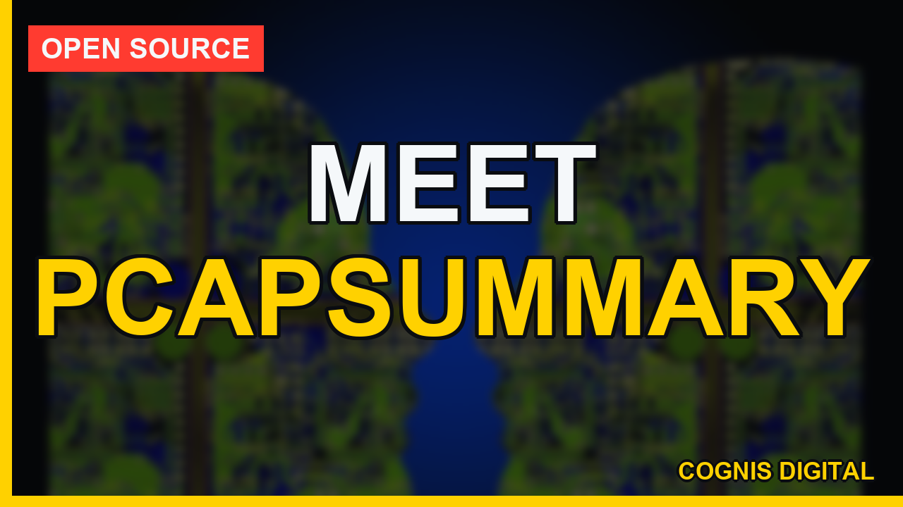
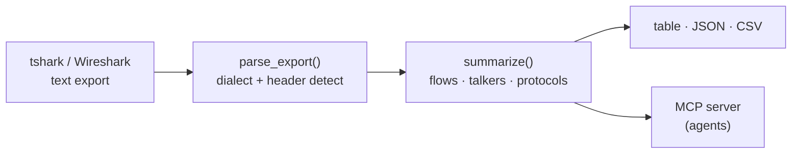

<a name="top"></a>
<div align="center">


# PCAPSUMMARY

### Summarize flows/talkers/protocols from a pcap text export


[](https://pypi.org/project/cognis-pcapsummary/) [](https://github.com/cognis-digital/pcapsummary/actions) [](LICENSE) [](https://github.com/cognis-digital)

*Part of the Cognis Neural Suite.*

</div>

```bash
pip install cognis-pcapsummary
pcapsummary scan .            # → prioritized findings in seconds
```


<!-- cognis:example:start -->

## Watch the walkthrough

A full narrated tour — setup, the tool in action, and every demo scenario:

[](https://github.com/cognis-digital/pcapsummary/releases/download/walkthrough-v1/walkthrough.mp4)

▶ **[Watch the walkthrough (MP4)](https://github.com/cognis-digital/pcapsummary/releases/download/walkthrough-v1/walkthrough.mp4)**

## 🔎 Example output

Real, reproducible output from the tool — runs offline:

```console
$ pcapsummary-emit --version
pcapsummary 0.1.0
```

```console
$ pcapsummary-emit --help
usage: pcapsummary [-h] [--version] {summarize} ...

Summarize flows/talkers/protocols from a pcap text export (defensive analysis
only; no live capture).

positional arguments:
  {summarize}
    summarize  summarize a tshark-style text export

options:
  -h, --help   show this help message and exit
  --version    show program's version number and exit
```

> Blocks above are real `pcapsummary` output — reproduce them from a clone.

**Sample result format** _(illustrative values — run on your own data for real findings):_

```
{
"findings": [
    {
        "id": "1234567890",
        "title": "Suspicious Network Traffic",
        "description": "Potential malicious activity detected on network interface 192.168.1.100",
        "created_at": "2023-02-20T14:30:00Z",
        "updated_at": "2023-02-20T14:30:01Z",
        "labels": ["malware", "network"],
        "observables": [
            {
                "type": "ip-dst",
                "value": "192.168.1.100"
            },
            {
                "type": "port",
                "value": 443
            }
        ]
    }
]
}
```

<!-- cognis:example:end -->

## Usage — step by step

`pcapsummary` summarizes flows/talkers/protocols from a pcap **text export** (defensive analysis only; no live capture). Exit codes: `0` clean, `1` findings/parse errors, `2` usage/file error.

1. **Install**:
   ```bash
   pip install -e .
   pcapsummary --version
   ```
2. **Produce a text export** with tshark, then summarize it:
   ```bash
   tshark -r capture.pcap -T fields -e frame.time_relative -e ip.src -e ip.dst > export.txt
   pcapsummary summarize export.txt
   ```
3. **Tune the report** — cap top talkers/flows with `--top`, or read from stdin:
   ```bash
   pcapsummary summarize export.txt --top 20
   cat export.txt | pcapsummary summarize -
   ```
4. **Read the output** as JSON (protocols, talkers, flows, time span) or CSV
   (one row per flow — drops straight into a spreadsheet or pandas):
   ```bash
   pcapsummary summarize export.txt --format json | jq '.protocols'
   pcapsummary summarize export.txt --format csv  > flows.csv
   ```
5. **Automate in CI** — a non-zero exit flags parse errors or empty captures:
   ```bash
   pcapsummary summarize export.txt --format json > pcap.json || echo "parse issues"
   ```

## Contents

- [Why pcapsummary?](#why) · [Features](#features) · [Quick start](#quick-start) · [Example](#example) · [Demos](#demos) · [Architecture](#architecture) · [AI stack](#ai-stack) · [How it compares](#how-it-compares) · [Integrations](#integrations) · [Install anywhere](#install-anywhere) · [Related](#related) · [Contributing](#contributing)

<a name="why"></a>
## Why pcapsummary?

pcap at a glance

`pcapsummary` is single-purpose, scriptable, and self-hostable: point it at a target, get prioritized results in the format your workflow already speaks (table · JSON · SARIF), gate CI on it, and let agents drive it over MCP.

<div align="right"><a href="#top">↑ back to top</a></div>

<a name="features"></a>
## Features

- ✅ Parse comma- **or** tab-separated tshark/Wireshark text exports (header auto-detect)
- ✅ Summarize flows, top talkers (bidirectional), and protocol distribution
- ✅ Output as **table**, **JSON**, or **CSV** (one row per flow)
- ✅ Exit codes for CI gating (`0` clean · `1` parse errors/empty · `2` usage)
- ✅ Eight worked [demo scenarios](#demos) (scan, beacon, exfil, DNS tunnel, lateral, …)
- ✅ Runs on Linux/macOS/Windows · Docker · devcontainer
- ✅ Ports in Python, JavaScript, Go, and Rust (`ports/`)

<div align="right"><a href="#top">↑ back to top</a></div>

<a name="quick-start"></a>
## Quick start

```bash
pip install cognis-pcapsummary
pcapsummary --version
pcapsummary scan .                       # scan current project
pcapsummary scan . --format json         # machine-readable
pcapsummary scan . --fail-on high        # CI gate (non-zero exit)
```

<div align="right"><a href="#top">↑ back to top</a></div>

<a name="example"></a>
## Example

```text
$ pcapsummary scan .
  [HIGH    ] PCA-001  example finding             (./src/app.py)
  [MEDIUM  ] PCA-002  another signal              (./config.yaml)

  2 findings · risk score 5 · 38ms
```

<div align="right"><a href="#top">↑ back to top</a></div>

<a name="demos"></a>
## Demos

Five **runnable, narrated scenarios** live in [`demos/`](demos/) — each runs the
real `pcapsummary` API/CLI over a bundled offline capture export and explains
the result for a specific audience. Every one exits `0` and is exercised by the
test suite. Full write-up: [`docs/DEMOS.md`](docs/DEMOS.md).

| Demo | Audience | What it shows |
|---|---|---|
| [`01_soc_triage`](demos/01_soc_triage.py) | Network / SOC analyst | Top talkers, dominant protocol, heaviest flow — pcap at a glance |
| [`02_threat_hunter_scan`](demos/02_threat_hunter_scan.py) | Threat hunter | One source fanning across 20 ports on one target = vertical TCP scan |
| [`03_ir_beacon_and_exfil`](demos/03_ir_beacon_and_exfil.py) | IR / forensics | Uniform C2 beacon cadence + upload-skewed byte asymmetry (exfil) |
| [`04_sysadmin_ci_gate`](demos/04_sysadmin_ci_gate.py) | Sysadmin / DevOps | Distinct `0`/`1`/`2` exit codes a CI pipeline can gate on |
| [`05_dns_tunnel_and_lateral`](demos/05_dns_tunnel_and_lateral.py) | Threat hunter / SOC | DNS dominance vs baseline + SMB sweep across `445` (lateral) |

```bash
PYTHONUTF8=1 python demos/run_all.py                 # all five, end to end
PYTHONUTF8=1 python demos/02_threat_hunter_scan.py   # or just one
```

Each scenario reads the capture fixtures in the `demos/NN-*/` folders, which
also carry a `SCENARIO.md` documenting how the export was produced. Triage one
directly with the CLI:

```bash
# Triage the scan capture as a table, then export its flows to CSV
python -m pcapsummary summarize demos/02-port-scan/capture_export.txt
python -m pcapsummary summarize demos/02-port-scan/capture_export.txt --format csv
```

> All demos use private RFC 1918 addresses, RFC 5737 documentation ranges
> (`203.0.113.0/24`, `198.51.100.0/24`), or real well-known public service IPs.
> They are **static analysis of already-captured exports** — no live capture,
> no network connections, authorized defensive use only.

<div align="right"><a href="#top">↑ back to top</a></div>

<a name="architecture"></a>
## Architecture



Full pipeline and data model: [`docs/ARCHITECTURE.md`](docs/ARCHITECTURE.md).

<div align="right"><a href="#top">↑ back to top</a></div>

<a name="ai-stack"></a>
## Use it from any AI stack

`pcapsummary` is interoperable with every popular way of using AI:

- **MCP server** — `pcapsummary mcp` (Claude Desktop, Cursor, Cognis.Studio, [uncensored-fleet](https://github.com/cognis-digital/uncensored-fleet))
- **OpenAI-compatible / JSON** — pipe `pcapsummary scan . --format json` into any agent or LLM
- **LangChain · CrewAI · AutoGen · LlamaIndex** — wrap the CLI/JSON as a tool in one line
- **CI / scripts** — exit codes + SARIF for non-AI pipelines

<div align="right"><a href="#top">↑ back to top</a></div>

<a name="how-it-compares"></a>
## How it compares

| | **Cognis pcapsummary** | tshark |
|---|:---:|:---:|
| Self-hostable, no account | ✅ | varies |
| Single command, zero config | ✅ | ⚠️ |
| JSON + SARIF for CI | ✅ | varies |
| MCP-native (AI agents) | ✅ | ❌ |
| Polyglot ports (JS/Go/Rust) | ✅ | ❌ |
| Open license | ✅ COCL | varies |

*Built in the spirit of **tshark**, re-framed the Cognis way. Missing a credit? Open a PR.*

<div align="right"><a href="#top">↑ back to top</a></div>

<a name="integrations"></a>
## Integrations

Pipes into your stack: **SARIF** for code-scanning, **JSON** for anything, an **MCP server** (`pcapsummary mcp`) for AI agents, and a webhook forwarder for SIEM/Slack/Jira. See [`docs/INTEGRATIONS.md`](docs/INTEGRATIONS.md).

<div align="right"><a href="#top">↑ back to top</a></div>

<a name="install-anywhere"></a>
## Install — every way, every platform

```bash
pip install "git+https://github.com/cognis-digital/pcapsummary.git"    # pip (works today)
pipx install "git+https://github.com/cognis-digital/pcapsummary.git"   # isolated CLI
uv tool install "git+https://github.com/cognis-digital/pcapsummary.git" # uv
pip install cognis-pcapsummary                                          # PyPI (when published)
docker run --rm ghcr.io/cognis-digital/pcapsummary:latest --help        # Docker
brew install cognis-digital/tap/pcapsummary                             # Homebrew tap
curl -fsSL https://raw.githubusercontent.com/cognis-digital/pcapsummary/main/install.sh | sh
```

| Linux | macOS | Windows | Docker | Cloud |
|---|---|---|---|---|
| `scripts/setup-linux.sh` | `scripts/setup-macos.sh` | `scripts/setup-windows.ps1` | `docker run ghcr.io/cognis-digital/pcapsummary` | [DEPLOY.md](docs/DEPLOY.md) (AWS/Azure/GCP/k8s) |

<div align="right"><a href="#top">↑ back to top</a></div>

<a name="related"></a>
## Related Cognis tools

- [`portfan`](https://github.com/cognis-digital/portfan) — Summarize and diff nmap XML into prioritized, attackable findings
- [`subhunt`](https://github.com/cognis-digital/subhunt) — Aggregate & dedupe subdomain enumeration from multiple sources
- [`dirsight`](https://github.com/cognis-digital/dirsight) — Analyze web content-discovery output (ffuf/gobuster) into ranked endpoints
- [`jwtinspect`](https://github.com/cognis-digital/jwtinspect) — Decode JWTs and lint for alg=none, weak secrets, and missing claims
- [`corsaudit`](https://github.com/cognis-digital/corsaudit) — Detect permissive/misconfigured CORS from headers or a config
- [`headerscan`](https://github.com/cognis-digital/headerscan) — Grade HTTP security headers (CSP/HSTS/XFO) A-F from a response dump

**Explore the suite →** [🗂️ all 170+ tools](https://github.com/cognis-digital/cognis-neural-suite) · [⭐ awesome-cognis](https://github.com/cognis-digital/awesome-cognis) · [🔗 cognis-sources](https://github.com/cognis-digital/cognis-sources) · [🤖 uncensored-fleet](https://github.com/cognis-digital/uncensored-fleet) · [🧠 engram](https://github.com/cognis-digital/engram)

<div align="right"><a href="#top">↑ back to top</a></div>

<a name="contributing"></a>
## Contributing

PRs, new rules, and demo scenarios are welcome under the collaboration-pull model — see [CONTRIBUTING.md](CONTRIBUTING.md) and [SECURITY.md](SECURITY.md).

> ### ⭐ If `pcapsummary` saved you time, **star it** — it genuinely helps others find it.

## Interoperability

`{}` composes with the 300+ tool Cognis suite — JSON in/out and a shared
OpenAI-compatible `/v1` backbone. See **[INTEROP.md](INTEROP.md)** for the
suite map, composition patterns, and reference stacks.

## License

Source-available under the **Cognis Open Collaboration License (COCL) v1.0** — free for personal, internal-evaluation, research, and educational use; **commercial / production use requires a license** (licensing@cognis.digital). See [LICENSE](LICENSE).

---

<div align="center"><sub><b><a href="https://cognis.digital">Cognis Digital</a></b> · one of 170+ tools in the <a href="https://github.com/cognis-digital/cognis-neural-suite">Cognis Neural Suite</a> · <i>Making Tomorrow Better Today</i></sub></div>
