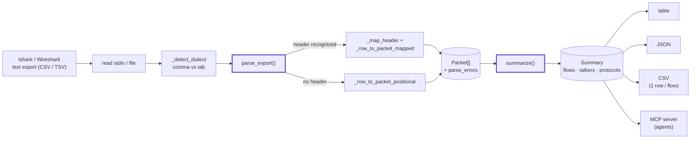
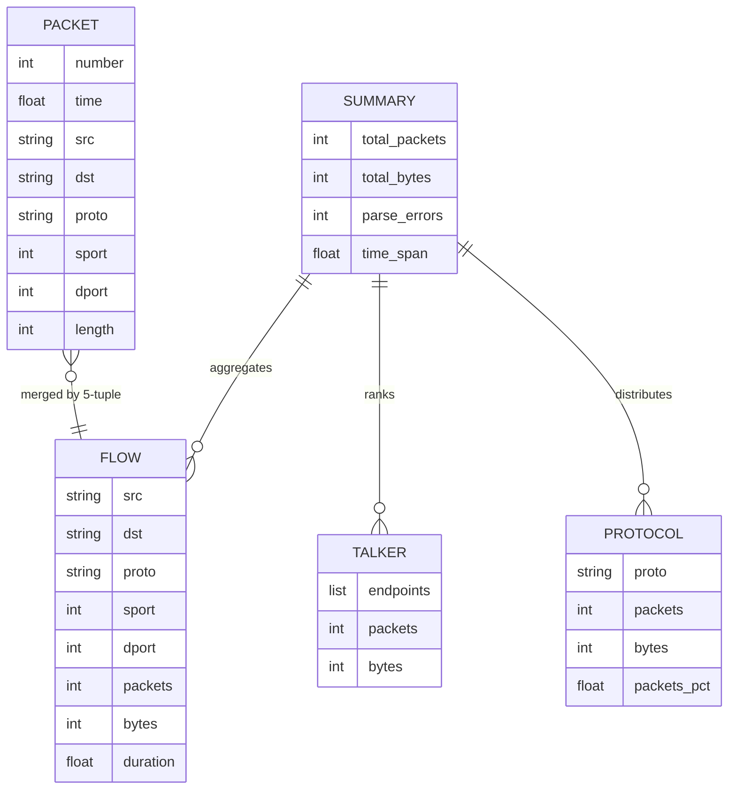

# PCAPSUMMARY — Architecture

> Summarize flows, talkers, and protocols from a pcap **text export** — static,
> offline, defensive analysis only. No live capture, no network connections.

`pcapsummary` takes a tshark/Wireshark text export (CSV or TSV), parses it into
packets, aggregates those into flows / talkers / protocol distribution, and
renders the result as a table, JSON, or one-row-per-flow CSV. Everything is
standard-library Python operating on a static file.

## The pipeline

## Components

### Parser (`pcapsummary/core.py` → `parse_export`)
`_detect_dialect` picks comma vs tab from the first data line. Rows are read
with `csv`, comment (`#`) and blank lines dropped. If the first row maps to at
least two known field aliases (`_map_header`), columns are addressed by name
(`_row_to_packet_mapped`); otherwise a documented positional layout is used
(`_row_to_packet_positional`). Returns `(packets, parse_errors)` — a row that
can't yield a `src`/`dst` pair counts as a parse error rather than crashing.

### Field aliasing
`_FIELD_ALIASES` maps many tshark/Wireshark column names
(`ip.src`/`ipv6.src`/`Source`, `tcp.dstport`/`udp.dstport`/`dstport`, …) onto a
small canonical set, so exports produced with different `-e` field lists or the
GUI "Export Packet Dissections" all parse. Protocol-specific TCP/UDP port
columns are coalesced into a single `sport`/`dport` per packet.

### Aggregator (`summarize`)
One pass over the packets builds:

- **Flows** keyed by the 5-tuple `(src, dst, proto, sport, dport)`, summing
  packets/bytes and tracking first/last timestamps (→ per-flow `duration`).
- **Talkers**: bytes and packets per *bidirectional* endpoint pair
  (`_normalized_pair` orders the pair so A→B and B→A merge), top-`N` by bytes.
- **Protocols**: packet/byte counts and percentage share, most-common first.
- Totals, time span, and the carried-through `parse_errors`.

### Renderers (`pcapsummary/cli.py`)
`_render_table` (human triage), `json.dumps(summary.as_dict())` (SIEM/jq/CI),
and `_render_csv` (one row per flow, heaviest first → spreadsheet/pandas).

### Exit codes (CI contract)
`0` clean · `1` parse errors **or** zero packets (an actionable finding) ·
`2` usage / file IO error. This is what the sysadmin CI-gate demo gates on.

### MCP server (`pcapsummary/mcp_server.py`)
Exposes the same summarize path to AI agents over MCP for offline analysis.

## Data model

## Why these choices

- **Static export, never live.** The tool reads a file you already captured. It
  opens no sockets, so it is safe to run anywhere, including CI.
- **Standard library only.** No heavy deps; `parse_export` + `summarize` are
  pure functions you can import and unit-test (see `tests/`, `demos/`).
- **Permissive input, strict output.** Many export shapes parse; unparseable
  rows are *counted*, not fatal — so a corrupted capture yields exit `1`, not a
  stack trace.

See the runnable scenarios in [`../demos/`](../demos/) and [DEMOS.md](DEMOS.md).
